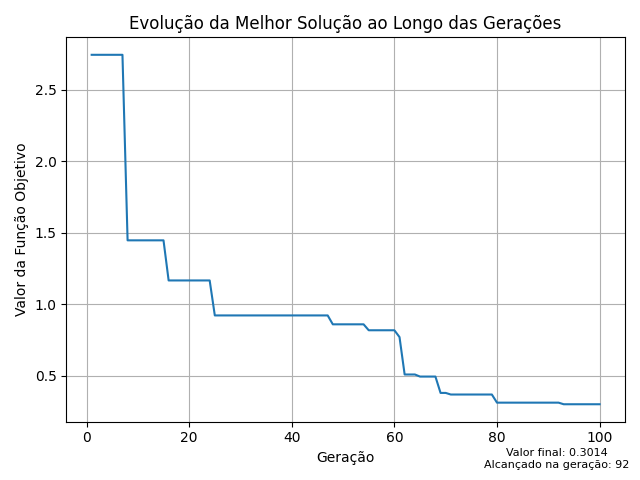

<h1 align="center">
    
</h1>

## Descrição do algoritmo
 - O algoritmo de evolução diferencial é uma meta-heurística baseada na teoria evolucionista de Darwin e no algoritmo genético, com algumas alterações para criar uma nova abordagem de evolução.
 - Cada solução representa um indivíduo, enquanto os cruzamentos e mutações garantem a exploração completa da região viável do problema.
 - Cruzamentos e mutações são realizadas através dos cromossomos de cada indivíduo