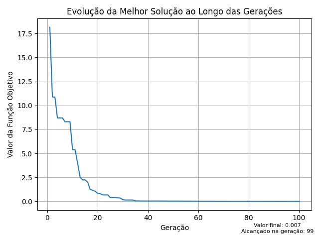

<h1 align="center">
    
</h1>

## Descrição do algoritmo
 - O algoritmo genético é uma meta-heurística baseada na teoria evolucionista de Darwin.
 - Cada solução representa um indivíduo, enquanto os cruzamentos e mutações garantem a exploração completa da região viável do problema.
 - Cruzamentos e mutações são realizadas através dos cromossomos de cada indivíduo