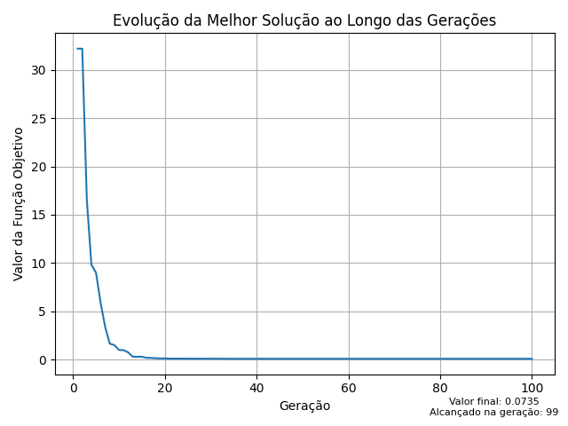

<h1 align="center">
    
</h1>

## Descrição do algoritmo
 - O algoritmo PSO é uma meta-heurística baseada no enxame de partículas.
 - Cada solução representa uma partícula, que possui seu vetor velocidade, posicao atual e a melhor posicao encontrada por ela ao longo das gerações.
 - A utilização mútua entre as taxas de auto exploração e exploração em direção à melhor posição global garantem a exploração da região viável por inteiro.
