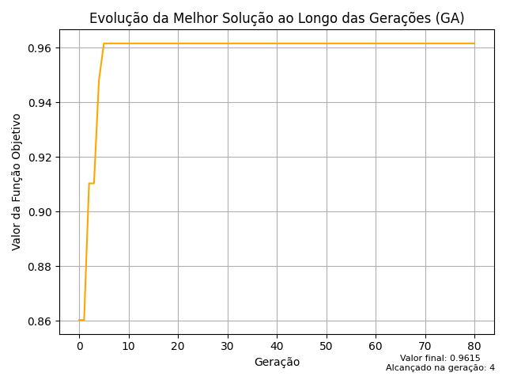
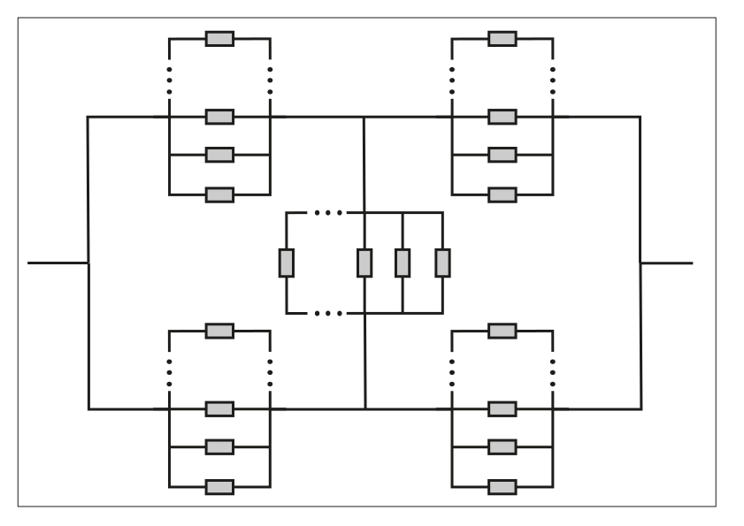
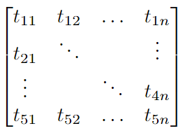

<h1 align="center">
    
</h1>

## Descrição do algoritmo
 - O algoritmo genético é uma meta-heurística baseada na teoria evolucionista de Darwin.
 - Cada solução representa um indivíduo, enquanto os cruzamentos e mutações garantem a exploração completa da região viável do problema.
 - Cruzamentos e mutações são realizadas através dos cromossomos de cada indivíduo.

## Definição da Função Objetivo:
 - O cenário é descrito por uma função de maximização ligada a confiabilidade do sistema com duas restrições de custo e peso. Por isso, foi utilizado método de penalização para cálculo da função objetivo:

  

## Descrição do cenário
 - O cenário tratado é considerando um sistema elétrico em ponte, onde cada componente é um subsistema de 3 a N (arbitrário e variável entre eles) componentes em paralelo.
 - Cada individuo é considerado como um cromossomo em matriz de 5 linhas e N colunas. Onde cada valor dentro dela se refere a um tipo de componente que foi gerado inicialmente no algoritmo.

    

 - A baixo podemos ver como modelamos o cromossomo e seu indivíduo, juntamente com um exemplo real, os 3 respectivamente:
 

    
    
    

 - Apesar da matriz ser definida em até N colunas, os subsistemas não ficam restritos a utilizar componentes em sua capacidade máxima.
 - Cada subsistema é gerado com o número de componentes de forma aleatória e pode ser alterado (aumentando ou diminuindo o número de componentes ativos) por meio de cross-over e mutação.
 - Os vagas de componentes que estão vazias são representadas por índices -1 e desconsiderados dos cálculos.

## Meios de Cross-Over e Mutação
 - O cross-over é definido a partir da união de duas partes de dois pais distintos, gerando um único filho. O pedaço de cada pai a ser dado é gerado de forma aleatória.
 - A mutação é definida pela mudança aleatória de um único componente no sistema inteiro. Sendo 20% de chance dele ser excluído e não reposto, enquanto os outros 80% de chance estão relacionados a alocação de outro componente aleatório.
