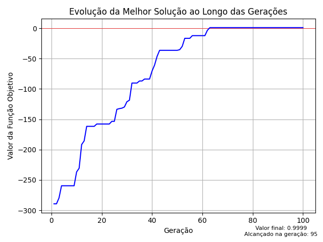

<h1 align="center">
    
</h1>

## Descrição do algoritmo
 - O algoritmo genético é uma meta-heurística baseada na teoria evolucionista de Darwin.
 - Cada solução representa um indivíduo, enquanto os cruzamentos e mutações garantem a exploração completa da região viável do problema.
 - Cruzamentos e mutações são realizadas através dos cromossomos de cada indivíduo.

## Descrição do cenário
 - O cenário tratado é considerando um sistema elétrico em ponte, onde cada componente é um subsistema de 3 a N (arbitrário e variável entre eles) componentes em paralelo.
 - Cada individuo é considerado como um cromossomo em matriz de 5 linhas e N colunas. Onde cada valor dentro dela se refere a um tipo de componente que foi gerado inicialmente no algoritmo.

<h1 align="center">
    
</h1>