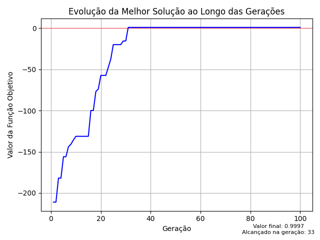

<h1 align="center">
    
</h1>

## Descrição do algoritmo
 - O algoritmo PSO é uma meta-heurística baseada no enxame de partículas.
 - Cada solução representa uma partícula, que possui seu vetor velocidade, posicao atual e a melhor posicao encontrada por ela ao longo das gerações.
 - A utilização mútua entre as taxas de auto exploração e exploração em direção à melhor posição global garantem a exploração da região viável por inteiro.

## Definição da Função Objetivo:
 - O cenário é descrito por uma função de maximização ligada a confiabilidade do sistema com duas restrições de custo e peso. Por isso, foi utilizado método de penalização para cálculo da função objetivo:

  

## Descrição do cenário
 - O cenário tratado é considerando um sistema elétrico em ponte, onde cada componente é um subsistema de 3 a N (arbitrário e variável entre eles) componentes em paralelo.
 - Cada partícula é considerado como um cubo de 5 linhas, N colunas e 3 camadas (posição, velocidade e melhor posição). Onde cada valor dentro dela se refere a um tipo de componente que foi gerado inicialmente no algoritmo.

    

 - Apesar da matriz ser definida em até N colunas, os subsistemas não ficam restritos a utilizar componentes em sua capacidade máxima.
 - Cada subsistema é gerado com o número de componentes de forma aleatória e pode ser alterado (aumentando ou diminuindo o número de componentes ativos) por meio do deslocamento da partícula.
 - Os vagas de componentes que estão vazias são representadas por índices -1 e desconsiderados dos cálculos.

