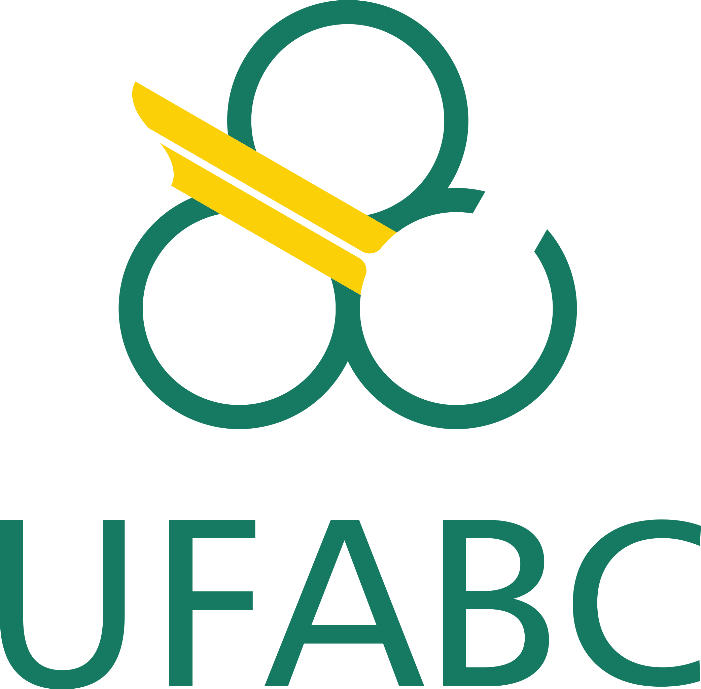

<h1 align="center">
    
    <br>
    <p>Projeto de Graduação em Computação</p>
    <p>João Vitor Arruda de Bartolo</p>
    <p>Orientador: Prof. Dr. Majid Forghani</p>
</h1>

<p>Aqui estão as implementações das meta-heurísticas utilizadas no projeto de graduação.</p>

- GA (Genetic Algorithm)
- PSO (Particle Swarm Optimization)
- DE (Differential Evolution)

<p>Todos os códigos estão em Python e geram logs e imagem de gráfico.</p>

## Como rodar?
 - Clone esse repositório na sua máquina.
 - Acesse a pasta do algoritmo que deseja:
 - Rode ```python nomeDoArquivo.py```